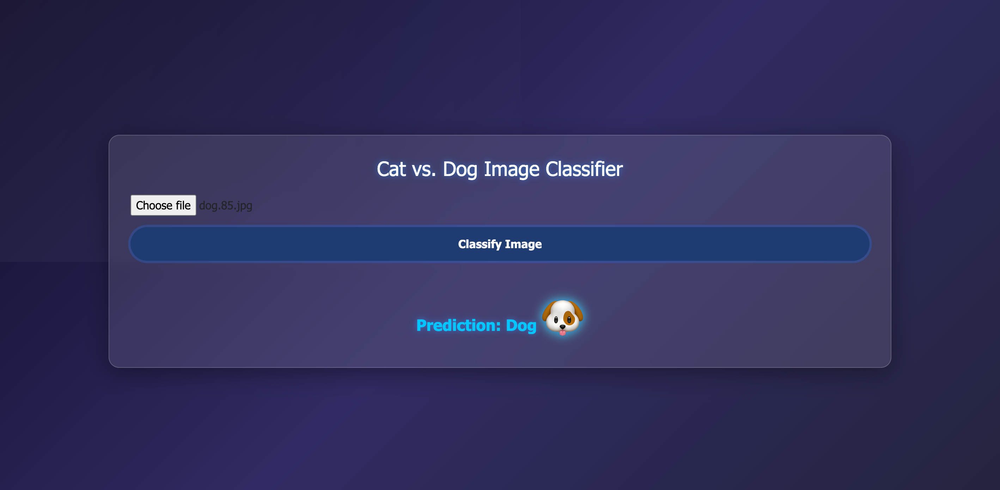

# Cat_dog

### Create an env
1. conda create -n catdog python=3.12 -y 
2. Create an temp.py where our folder drctry will added
3. Create an requirement file and run the dependencies 
touch requirements.txt -> Create the file
pip install -r requirements.txt -> run the file
3. Added the logger file
4. prepare/update the common.py and utility

@staticmethod is a decorator in Python used to define methods inside a class that do not require access to the instance (self) or class (cls). This means that @staticmethod can be called on the class itself without needing to create an instance of the class, and it does not modify or rely on instance-specific data
basically class instance and self not to required to use the function if the fuction have @static method

# Workflows
 1. Update config.yaml
here we will store the config things example data set path to get the data/store the data etc
2. Update params.yaml
3. Update entity
entity is nothing but the return type of a function
entity where we just store the data paths only, once configuration manager will execute then it will return the and store the data as per the entity data storage path
4. Update the configuration manager in src config
configuration manager where we will read the config/params yaml and and return the data to the entity folder, this will used in pipeline 
5. update the components
this .py file will zip unzip the data and store the data into the respective folder, once the configuration manager will execute then it will return the and store the data as per the entity data storage path
6. update the pipeline

7. update the main.py
to run the pipe line we need write the pieace of code
8. update the app.py

# Docker 
1. run the application on local docker
docker build -t cat-dog- .
smh is my image name
#### it will create an local image
2. docker run -p 8080:8080 cat-dog
#### run the docker file

# 1. Login to AWS console.
# 2. Create IAM user for deployment

#with specific access

1. EC2 access : It is virtual machine

2. ECR: Elastic Container registry to save your docker image in aws

#Description: About the deployment

1. Build docker image of the source code

2. Push your docker image to ECR

3. Launch Your EC2 

4. Pull Your image from ECR in EC2

5. Lauch your docker image in EC2

# Policy:

1. AmazonEC2ContainerRegistryFullAccess

2. AmazonEC2FullAccess
3. Create ECR repo to store/save docker image
- Save the URI: 566373416292.dkr.ecr.us-east-1.amazonaws.com/text-s
4. Create EC2 machine (Ubuntu)
5. Open EC2 and Install docker in EC2 Machine:
#optinal

sudo apt-get update -y

sudo apt-get upgrade

#required

curl -fsSL https://get.docker.com -o get-docker.sh

sudo sh get-docker.sh

sudo usermod -aG docker ubuntu

newgrp docker
# 6. Configure EC2 as self-hosted runner:
setting>actions>runner>new self hosted runner> choose os> then run command one by one
# 7. Setup github secrets:
AWS_ACCESS_KEY_ID=

AWS_SECRET_ACCESS_KEY=

AWS_REGION = us-east-1

AWS_ECR_LOGIN_URI = demo>>  566373416292.dkr.ecr.ap-south-1.amazonaws.com

ECR_REPOSITORY_NAME = simple-app
